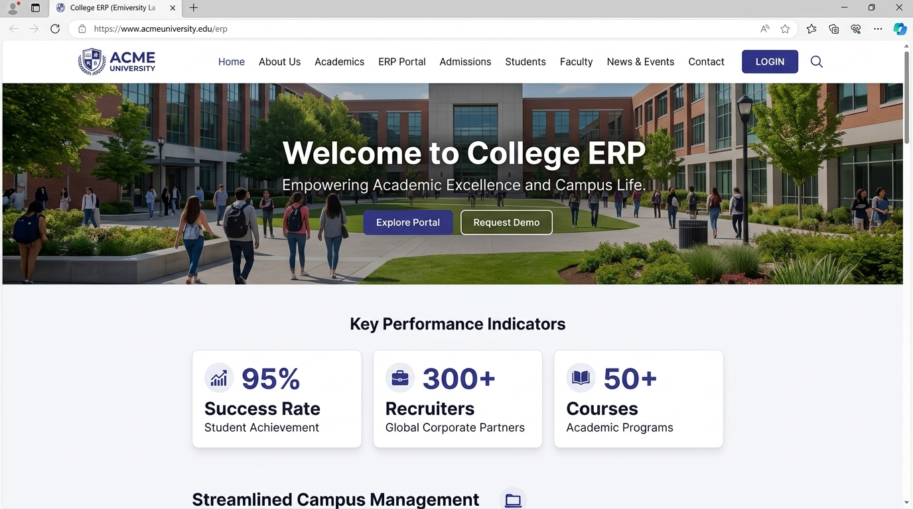
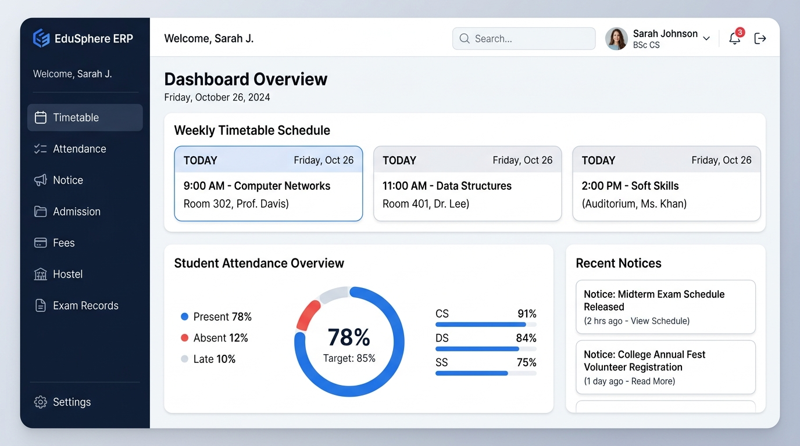
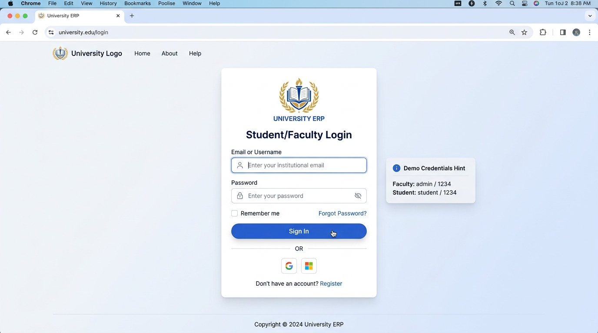

<div align="center">

  # 🎓 College ERP

  **A modern, lightweight institutional web portal & academic management dashboard.**  
  Attendance Tracking · Timetable Schedules · Notice Board · Role-Based Access · Exam Records

  <br />

  <p>
    <a href="https://college-erp-aadi.web.app" target="_blank">
      
    </a>
    <a href="LICENSE">
      
    </a>
    <a href="https://college-erp-aadi.web.app">
      
    </a>
  </p>

  <p>
    <strong>🔗 Live Application URL:</strong> <a href="https://college-erp-aadi.web.app" target="_blank">https://college-erp-aadi.web.app</a>
  </p>

  

</div>

---

<div align="center">

  ### Tech Stack

  <p>
    
    
    
    
    
    
    
  </p>

</div>

---

## 📸 Application Showcase

### 1. Institutional Landing Portal


### 2. Student & Faculty ERP Dashboard


### 3. Authentication & Login Portal


---

## What is College ERP?

**College ERP** is a fully client-side academic management portal and university web platform. Designed with an eye-friendly, modern slate-and-indigo aesthetic, it eliminates the need for heavyweight backend servers by managing authentication, student profiles, attendance, and administrative records entirely in the browser using `localStorage`.

The platform provides an institutional landing portal alongside an interactive dashboard tailored for both **Students** and **Faculty**.

---

## 👥 Role-Based Capabilities & Features

College ERP provides distinct capabilities depending on the user's role:

### 👨‍🏫 Faculty / Teachers
Faculty members have administrative and instructional authority over classroom records:
- **Attendance Management**: Mark, edit, and update daily student attendance across batches and lecture sessions.
- **Timetable Authoring**: Create, schedule, and configure timetable cards with subject names, lecture halls, and timings.
- **Notice Publishing**: Broadcast institutional circulars, exam dates, and student announcements.
- **Academic Evaluation**: Manage continuous assessments and exam marks records.
- **Administrative Privileges**: Access faculty-exclusive tools and modify operational data.

### 🎓 Students
Students have an interactive self-service view of their academic standing:
- **Attendance Monitoring**: View personal attendance percentages, present/absent ratios, and attendance warning indicators.
- **Timetable Viewer**: Inspect daily class schedules, subject assignments, and assigned faculty details.
- **Notice Board**: Stay updated with the latest campus news, events, and department notices.
- **Campus Services**: Check admission details, fee collection status, and hostel room allocations.
- **PDF Report Generation**: Export and download official academic records and marksheets using `jsPDF`.

### ⚖️ Capability Comparison (Faculty vs. Student)

| Feature / Action | 👨‍🏫 Faculty | 🎓 Student |
| :--- | :---: | :---: |
| Mark & Edit Student Attendance | ✅ Full Access | ❌ View Only |
| Create & Reorder Timetable Slots | ✅ Full Access | ❌ View Only |
| Publish Official Notices | ✅ Full Access | ❌ View Only |
| Enter Examination Marks | ✅ Full Access | ❌ View Only |
| View Personal Academic Records | ✅ Yes | ✅ Yes |
| Download PDF Reports | ✅ Yes | ✅ Yes |
| Self-Register New Accounts | ❌ Admin Pre-seeded | ✅ Default Role |

---

## 🔑 Default Credentials

For quick exploration, the following credentials are pre-seeded in the system:

| Role | Username | Password | Access Level |
| :--- | :--- | :--- | :--- |
| **Faculty / Admin** | `admin` | `1234` | Full Faculty & Admin Dashboard Access |
| **Student** | `student` | `1234` | Student Dashboard & Academic Records |

> **Note:** Any new accounts registered via the [Registration Form](register.html) are assigned **Student** access by default.

---

## 📁 Project Structure

```text
College-ERP/
├── assets/                  # Institutional logos, banners, and screenshots
│   ├── background.png
│   ├── college-bg.jpg
│   ├── college-life.jpg
│   ├── logo.png             # Clean light-themed academic emblem
│   ├── screenshot-home.png      # Landing portal screenshot
│   ├── screenshot-dashboard.png # ERP dashboard screenshot
│   ├── screenshot-login.png     # Login auth screenshot
│   └── teacher.jpg
├── css/                     # Stylesheets
│   ├── auth.css             # Authentication styling
│   ├── nstyles.css          # Eye-friendly academic landing page styles
│   └── style2.css           # Dashboard layout & widget styles
├── js/                      # Frontend JavaScript
│   ├── attendance.js        # Attendance computation & UI
│   ├── script.js            # Auth and user session management
│   └── script2.js           # Dashboard routing and state handling
├── auth.html                # Unified modal authentication page
├── dashboard.html           # Student & Faculty ERP Dashboard
├── index.html               # Institutional Landing Page
├── login.html               # Login page
├── register.html            # Registration page
├── .firebaserc              # Firebase project target configuration
├── firebase.json            # Firebase Hosting configuration
├── .gitignore               # Ignored build, cache, and system files
├── LICENSE                  # MIT License
└── README.md                # Project documentation
```

---

## 🚀 Getting Started

### 1. Clone the Repository
```bash
git clone https://github.com/aadisthunder/College-ERP.git
cd College-ERP
```

### 2. Run Locally
Because College ERP is built with vanilla web technologies, you can open `index.html` directly in any modern browser:

- Double-click `index.html` or drag it into Chrome/Edge/Firefox.
- Alternatively, serve via any static HTTP server:
```bash
npx serve .
```
Then visit `http://localhost:3000`.

---

## 🔥 Deployment to Firebase Hosting

This project is pre-configured for **Firebase Hosting**.

1. Ensure Firebase CLI is installed and authenticated:
   ```bash
   npm install -g firebase-tools
   firebase login
   ```

2. Deploy hosting:
   ```bash
   firebase deploy --only hosting
   ```

Live site: [https://college-erp-aadi.web.app](https://college-erp-aadi.web.app)

---

## 🤝 Contributing

Contributions, issues, and feature requests are welcome!

1. Fork the Project
2. Create your Feature Branch (`git checkout -b feature/AmazingFeature`)
3. Commit your Changes (`git commit -m 'Add some AmazingFeature'`)
4. Push to the Branch (`git push origin feature/AmazingFeature`)
5. Open a Pull Request

---

## 📄 License

Distributed under the MIT License. See [`LICENSE`](LICENSE) for more information.
